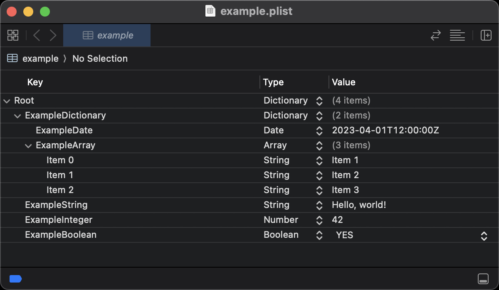

# crystal-bplist

[](https://github.com/mamantoha/crystal-bplist/actions/workflows/crystal.yml)
[](https://github.com/mamantoha/crystal-bplist/releases)
[](https://mamantoha.github.io/crystal-bplist/)
[](https://github.com/mamantoha/crystal-bplist/blob/main/LICENSE)

Apple's binary property list format implementation in Crystal.

`bplist` module provides an interface for reading and writing the “property list” files used by Apple, primarily on macOS and iOS.
This module supports only binary plist files.

Values can be strings, integers, floats, booleans, arrays, hashes (but only with string keys), `Bytes`, or `Time` objects.

## Installation

1. Add the dependency to your `shard.yml`:

   ```yaml
   dependencies:
     bplist:
       github: mamantoha/crystal-bplist
   ```

2. Run `shards install`

## Usage

### `Bplist::Writer`

Transform a Crystal hash into bplist format:

```crystal
require "bplist"

hash = {
  "ExampleDictionary" => {
    "ExampleDate" => Time.parse("2023-04-01 12:00:00 +00:00", "%Y-%m-%d %H:%M:%S %z", Time::Location::UTC),
    "ExampleArray" => [
      "Item 1",
      "Item 2",
      "Item 3",
    ],
  },
  "ExampleString" => "Hello, world!",
  "ExampleInteger" => 42,
  "ExampleBoolean" => true,
}

writer = Bplist::Writer.new(hash)
writer.write_to_file("#{__DIR__}/../assets/example_mod.plist")
```

```sh
crystal ./samples/write.cr
```



Rewrite the property list file in XML format:

```sh
plutil -convert xml1 assets/example_mod.plist -o assets/example_mod.xml
cat assets/example_mod.xml
```

```xml
<?xml version="1.0" encoding="UTF-8"?>
<!DOCTYPE plist PUBLIC "-//Apple//DTD PLIST 1.0//EN" "http://www.apple.com/DTDs/PropertyList-1.0.dtd">
<plist version="1.0">
<dict>
  <key>ExampleBoolean</key>
  <true/>
  <key>ExampleDictionary</key>
  <dict>
    <key>ExampleArray</key>
    <array>
      <string>Item 1</string>
      <string>Item 2</string>
      <string>Item 3</string>
    </array>
    <key>ExampleDate</key>
    <date>2023-04-01T12:00:00Z</date>
  </dict>
  <key>ExampleInteger</key>
  <integer>42</integer>
  <key>ExampleString</key>
  <string>Hello, world!</string>
</dict>
</plist>
```

### `Bplist::Parser`

Parse a binary plist file and retrieve a `Bplist::Any` object:

```crystal
require "bplist"

bplist = Bplist::Parser.new("#{__DIR__}/../assets/example.plist")

result = bplist.parse
pp result
```

```crystal
{"ExampleDictionary" =>
  {"ExampleDate" => 2023-04-01 12:00:00.0 UTC,
   "ExampleArray" => ["Item 1", "Item 2", "Item 3"]},
 "ExampleString" => "Hello, world!",
 "ExampleInteger" => 42,
 "ExampleBoolean" => true}
```

### Reading and modifying Plist

The `Bplist::Any` object returned by the parser is immutable. To modify plist data, you need to convert it to native Crystal types first.

```crystal
require "bplist"

# Read the plist file
bplist = Bplist::Parser.new("config.plist")
result = bplist.parse # Bplist::Any (immutable)

# Convert to modifiable Hash
data = result.to_h # Hash(String, Bplist::Any::NativeType) - mutable

# Modify the data
data["last_modified"] = Time.utc
data["version"] = (data["version"]?.as(Int32) || 0) + 1
data["new_key"] = "new_value"

# Access and modify nested structures
if data["settings"]?.is_a?(Hash)
  settings = data["settings"].as(Hash)
  settings["theme"] = "dark"
  settings["notifications"] = true
else
  # Create new nested structure
  data["settings"] = {
    "theme" => "dark",
    "notifications" => true,
    "auto_save" => false
  }
end

# Write the modified data back to file
writer = Bplist::Writer.new(data)
writer.write_to_file("config.plist")
```

## Useful links

- https://medium.com/@karaiskc/understanding-apples-binary-property-list-format-281e6da00dbd
- https://github.com/opensource-apple/CF/blob/master/CFBinaryPList.c
- https://docs.python.org/3/library/plistlib.html
- https://github.com/python/cpython/blob/main/Lib/plistlib.py
- http://fileformats.archiveteam.org/wiki/Property_List/Binary

## Contributing

1. Fork it (<https://github.com/mamantoha/crystal-bplist/fork>)
2. Create your feature branch (`git checkout -b my-new-feature`)
3. Commit your changes (`git commit -am 'Add some feature'`)
4. Push to the branch (`git push origin my-new-feature`)
5. Create a new Pull Request

## Contributors

- [Anton Maminov](https://github.com/mamantoha) - creator and maintainer
